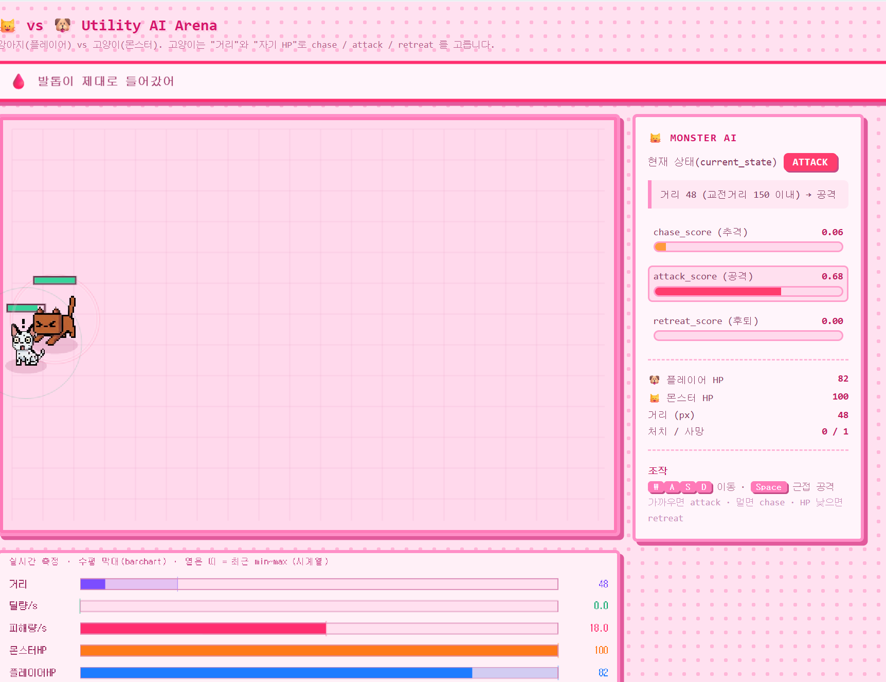

# 🐱 vs 🐶 Utility AI Arena

강아지(플레이어) vs 고양이(몬스터) 대결을 통해 **Utility AI**의 의사결정 과정을 시각화하는 브라우저 게임입니다.



## 소개

고양이(몬스터)는 **적과의 거리**와 **자기 HP**만 보고 세 가지 행동의 점수를 실시간으로 계산해, 가장 높은 행동을 선택합니다.

- **chase (추격)** — 멀고 + 건강할 때
- **attack (공격)** — 가깝고 + 건강할 때
- **retreat (후퇴)** — HP가 임계치 밑으로 떨어졌을 때 (적이 가까울수록 위급)

우측 패널에서 각 행동의 점수와 선택 이유(reason)를 실시간으로 확인할 수 있고, 하단 막대 차트로 측정값을 추적합니다. 상태가 자주 흔들리지 않도록 히스테리시스(BIAS)를 적용했습니다.

## 조작

| 키 | 동작 |
| --- | --- |
| `W` `A` `S` `D` | 이동 |
| `Space` | 근접 공격 |

## 실행

별도 빌드 없이 `index.html`을 브라우저에서 열면 됩니다.

```
# 로컬 서버 예시 (선택)
python -m http.server
# → http://localhost:8000
```

## 구조

기능별로 스크립트가 분리되어 있으며, `index.html`에서 의존성 순서대로 로드합니다.

```
index.html
assets/                스프라이트 이미지 · 스크린샷
styles/styles.css      스타일
src/
├─ core/               config.js(상수/색/스프라이트 매핑) · utils.js(수학 헬퍼) · game.js(게임 루프)
├─ data/               notices.js(공지 멘트 데이터)
├─ entities/           entities.js(플레이어/몬스터 상태) · sprites.js(스프라이트 로딩/그리기)
├─ systems/            input.js(키 입력) · ai.js(Utility AI 판단) · update.js(이동/전투/사망) · metrics.js(DPS/막대차트)
└─ render/             render.js(캔버스 렌더+막대차트) · ui.js(우측 패널 DOM) · notice.js(공지 배너 컨트롤러)
```
